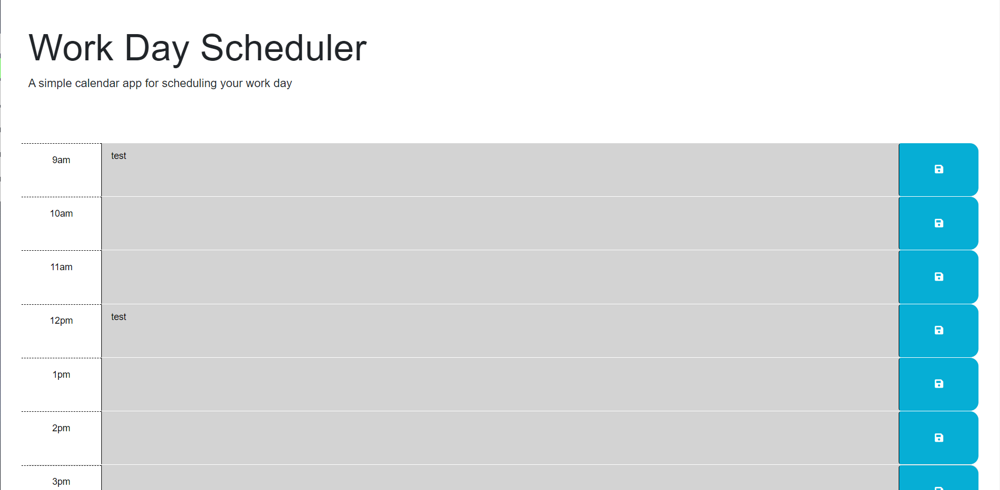

# Challenge5

On this challenge I had to finish a hourly based calendar. 
Had to make the hour slot change color based on what time it currently was, if it is before then it should be grey, after:green, and during:red.

Used a lot of external google, more than any other project thus far. I feel like I understand JQuery so much more now(also makes life so much easier) 

had originally planend to put all the "hour-x" IDs on an array and do array[var ].addClass("past"); as time went on. But the for loop started giving me too many issues. it was going to be 2 loops, one before current timeto add past, one after current time to add future, and an if statement if it was same time. 

Somethign I realized while doing the loop was my lack of undestanding for JQuery, doing ALOT of research I scapped the for loop all together and found a cleaner way of comparing the time. 

Overall I feel this is the project I have learned the most from, specially tools to use in the future. Really need to practice this more too

Link: https://manuelc0159.github.io/Challenge5/

